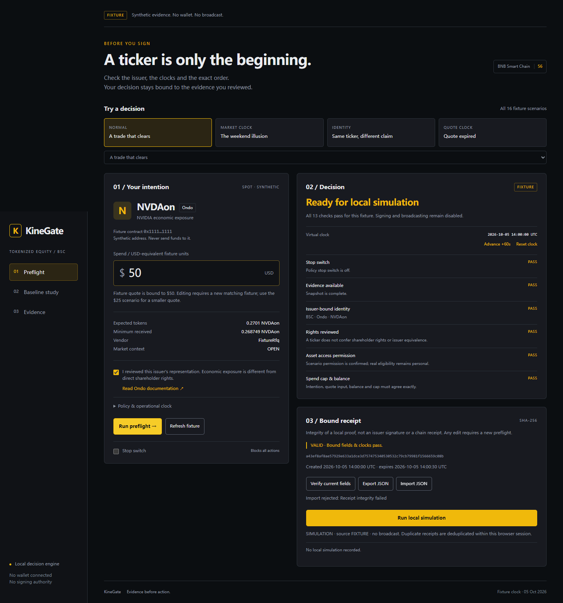

# KineGate

**A ticker is only the beginning.** KineGate turns one tokenized-equity trade intention into an expiring preflight receipt bound to the issuer, exact amount, quote clocks, permissions and execution evidence. Edit a reviewed field and the old receipt becomes invalid.

The no-wallet workspace is a complete **FIXTURE / local SIMULATION** experience: sixteen scenarios, thirteen deterministic checks, receipt export/import, clock expiry and a same-input comparison. It never signs or broadcasts. Four authenticated Binance RWA endpoints returned **HTTP200 / business code 0**. Inspect their recorded **REPLAY** in Evidence, or refresh locally. A separate 6 USDT quote succeeded with LiquidMesh / SWAP; its replay retains absent expiry/minimum-output fields and disabled trading. Recorded SWAP evidence now runs through the same thirteen gate definitions and exports a separate non-executable historical audit. Unknown fields stay WAIT; failed effects and exact slippage violations BLOCK. A three-way native simulation isolates gas and tests a minimum-output rejection at one pinned block; a later owner-completed external-venue buy is documented separately in the [live settlement supplement](docs/mainnet-settlement.md), including its allowance exception.

**[Try the deployed demo](https://zoahdev.github.io/kinegate/)** · **[Public source](https://github.com/zoahdev/kinegate)** · **[2m14s narrated demo](https://github.com/zoahdev/kinegate/releases/tag/demo-polished-v1)**. The refreshed video adds disclosed synthetic English narration, an original ambient score, eased camera movements and transitions to the actual recording. The project is published under the owner’s personal GitHub account. Fresh anonymous Pages workflow, public video download metadata and Linux CI passed. [Current access status](evidence/accessibility-current.json). All submission gates are tracked in [the audit](docs/submission-audit.md).



## Try in a minute

Requires Node.js 24+. No credentials or wallet needed.

```sh
npm ci
npm start
```

Open http://127.0.0.1:4173 . Run preflight on the $50 fixture, export its receipt, run local simulation, then edit the amount to $51. Choose the weekend, different-issuer or expired-quote cases to inspect exact blocking reasons. Advance the virtual clock to expire a valid receipt. The $25 scenario provides a correctly matching smaller fixture quote.

## Evidence before action

- [Test run](evidence/tests-run.txt): 58 unit/integration checks, including exact arithmetic, malformed policy, whitelist, tampering, clock expiry, signed-request bytes, bounded retry, native Windows timestamp preservation and local server protection.
- [Browser evidence](evidence/browser-qa.json): 33 actual browser checks, all sixteen scenarios, real API replay, recovery/import rejection, 360px layout and keyboard smoke. [Mobile screenshot](evidence/mobile-yellow.png).
- [Comparison](evidence/fixture-benchmark.json): 16 authored fixtures; simplified display-price comparator accepts 13 of 14 policy-unsafe cases, gate accepts 0. Constructed fault cases are not a real-world safety or profitability estimate.
- [Independent review](evidence/review-independent.md): reproduced bugs and fixes, HTTP isolation checks, explicit limitations.
- [Authenticated acquisition](evidence/devex/authenticated-rwa.json): 488 BSC catalog records; current AAPLon identity, price, issuer profile and market. Four HTTP200/code0 responses, request times and latency; no execution claim.
- [Observed SWAP audit](evidence/observed-audit.json): thirteen shared gate definitions applied to four recorded real sources, edit/stop/source invalidation and explicit non-executable export. The saved minimum fails exact slippage arithmetic; no rounding exception is granted.
- [Controlled native simulation](evidence/mainnet/native-simulation-comparison.json): identical payload and pinned state fail at the builder's 450000 gas estimate, succeed at a bounded 1183991 limit, and revert when a matching minimum word is doubled. Counterfactual approval only; no transaction or spending. [Scope and reproduction](docs/native-simulation.md).
- [Unsigned execution check](evidence/devex/unsigned-swap-validation.json): the first actual off-chain simulation predicted FAILED from insufficient balance. A [later fresh check](evidence/devex/unsigned-swap-allowance-validation.json) predicted FAILED from insufficient allowance. No approval, signature or broadcast occurred. [Bounded mainnet proposal](docs/mainnet-operation-pack.md) retains the unresolved router/source/ABI prerequisite.
- [Actual quote acquisition](evidence/devex/authenticated-quote-6usdt.json): one HTTP200/code0 6 USDT → AAPLon route, actual mode SWAP. Earlier 1 and 5 USDT inputs returned 40375. Historical quote; no order or funded trade.
- [Matching BSC acquisition](evidence/mainnet/current-api-asset-readonly.json): API-listed AAPLon contract code, symbol and 18 decimals at one pinned block. No liquidity, eligibility or transaction claim. The earlier campaign AAPLB address was not in this current catalog.
- [Real no-key API response](evidence/devex/unauthenticated-probe.json): HTTP401/code40101, **not** successful data integration.
- [Claims and their limits](docs/claims.md), [judging map](docs/judging.md), [rules](docs/rules.md).

The referencePrice field in RWA data is derived per-share token value; it must not be marketed as an independent executable stock quote. RFQ typed data and EVM simulation require separate execution-mode handling. A receipt hash checks internal consistency, not source authenticity or chain settlement.

## Architecture and local API

Pure bigint checks in `src/engine.mjs`; original fixture dataset in `src/fixtures.mjs`; vanilla module UI; loopback Node server and minimal documented HMAC adapter. Public production build is static and excludes all credentials and the API server. Static hosting shows API unavailability explicitly.

For authorized API reads, copy `.env.example` to ignored `.env`, configure `OC_API_KEY` and `OC_SECRET_KEY` locally, and personally confirm API qualification before enabling its flag. Restart the server; `npm run probe -- status`, `npm run probe -- discovery`, `npm run probe -- asset 0x390a684ef9cade28a7ad0dfa61ab1eb3842618c4`. Windows requires PowerShell 7.5+ (`pwsh.exe`); other systems use Node fetch. Local endpoints: `/api/status`, `/api/discovery`, `/api/asset?address=<allowlisted-contract>`. RWA inspection compares exact endpoint identity, ratio and clocks, and keeps absent trading evidence as WAIT. No broadcast/signing route exists. Issuer trading eligibility is a separate personal check.

[API contract sources](docs/api-contracts.md) · [Architecture](docs/architecture.md) · [Safety](docs/security.md) · [Recovery and human reproduction](docs/devex-reproduction-guide.md) · [Open-source attribution](docs/attribution.md).

## Verify and record

```sh
npm test
npm run lint
npm run typecheck
npm run benchmark
npm run build
node scripts/browser-qa.mjs
node scripts/record-demo.mjs
```

Type checking covers the engine, observed evidence adapter, fixtures and request adapter; UI and server syntax are checked by the bounded custom lint. Browser tooling uses installed Edge on Windows, Chromium on other platforms (`npx playwright install chromium` if needed). Start the server first. Recorded video uses actual application interactions; captions and recording steps live in `demo/`. No final human DevEx report is generated.

## Competition readiness

Registration, human-authored DevEx and project form responses are recorded. A later owner-completed BSC purchase is confirmed in the [settlement supplement](docs/mainnet-settlement.md); it used the external PancakeSwap UI and exceeded the original allowance cap. Cleanup is confirmed with zero allowance, exact signing-time slippage evidence is absent, and Binance Trading API execution remains unverified. [Actual form fields](docs/submission-fields.md), [human gates](docs/human-actions.md), [submission audit](docs/submission-audit.md). [Redacted form receipts](evidence/submission/) are available; they do not establish organizer acceptance. MIT-licensed original project; no issuer or Binance endorsement claimed.

The [tighter-slippage follow-up](evidence/mainnet/tight-slippage-native-comparison.json) requested 0.49% and returned a minimum meeting the exact authorized 0.5% cap. Native same-payload/block gas comparison again failed at 450000 and succeeded at a bounded higher limit; doubled-minimum control failed. Six controlled simulations in total; those experiments spent no assets. The later external owner trade is separate. No historical quote is execution-ready.
